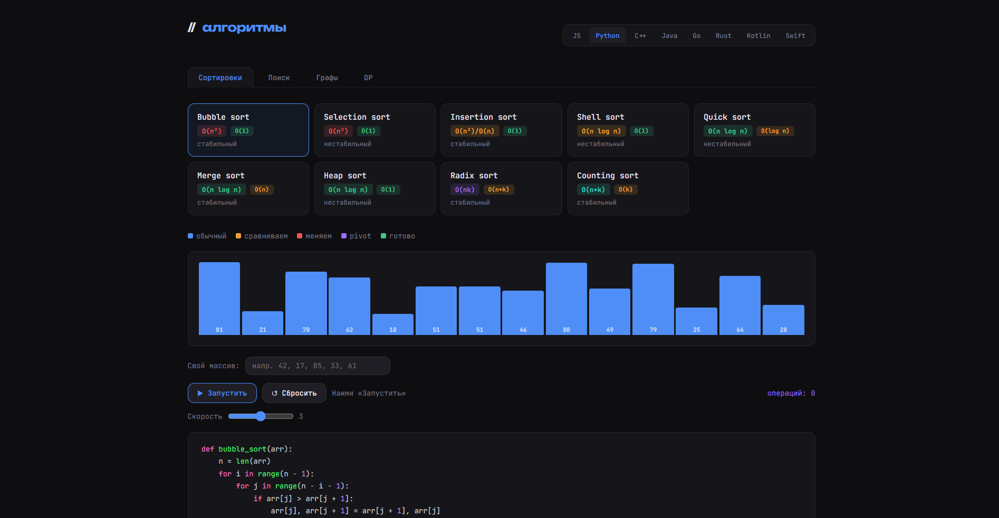

# algoviz

Интерактивный визуализатор алгоритмов. Показывает пошаговую работу алгоритмов сортировки, поиска, обходов графа и динамического программирования — с кодом на 8 языках программирования.



## Алгоритмы

**Сортировки** — Bubble, Selection, Insertion, Shell, Quick, Merge, Heap, Radix, Counting

**Поиск** — Linear, Binary, Jump, Interpolation, Exponential

**Графы** — BFS, DFS, Dijkstra

**Динамическое программирование** — Fibonacci, 0/1 Knapsack, LCS, LIS

## Возможности

- Пошаговая визуализация с регулировкой скорости
- Пауза и режим «шаг за шагом»
- Счётчик операций в реальном времени
- Код на JS, Python, C++, Java, Go, Rust, Kotlin, Swift
- Подробное описание каждого алгоритма: идея, сложность, плюсы/минусы
- Свой массив для сортировки
- Граф с весами рёбер

## Веб-версия

Открой `src/index.html` напрямую в браузере — никакой сборки не нужно.

## Десктопное приложение

Требования: [Node.js](https://nodejs.org) и [Rust](https://rustup.rs)

```bash
git clone https://github.com/remodik/Algorithms-Vizualizer
cd Algorithms-Vizualizer\AlgoViz
npm install
npm run tauri build
```

Готовый `.exe` будет в `src-tauri/target/release/bundle/`.

Для режима разработки:

```bash
npm run tauri dev
```

## Стек

- **Frontend** — vanilla HTML / CSS / JavaScript, без фреймворков
- **Desktop** — [Tauri 2](https://tauri.app) + Rust

## Лицензия

MIT